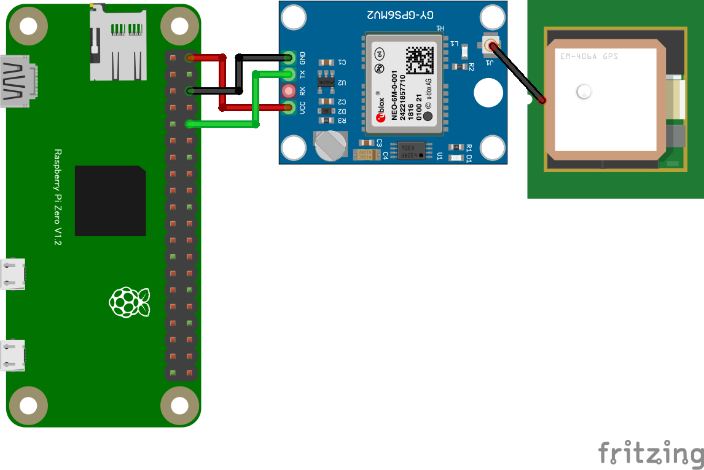

PiZeroのシリアル端子に、GY-GPS6MV2等のシリアル接続GPSレシーバーを繋ぐ

* OSの設定
  * ```sudo raspi-config```
  * Interface Options -> Serial Port -> Login over serial: いいえ , serial port enabled: はい
  * Note: この設定はUSBシリアルのコンソールログインには影響しない
* 結線 (GPSのRX端子の結線は基本動作では不要) : 下図参照
  * 動作検証したモジュール
    * https://electronicwork.shop/items/625c1ca99fe3d707d725cbe1
  * 同等品と考えられるもの
    * https://www.amazon.co.jp/dp/B07LF6KGR8
    * https://www.aitendo.com/product/10255
* 動作確認
  * ```cat /dev/ttyS0```
  * Note: GPS衛星電波受信されていなくてもメッセージが出力される。 ```/dev/serial0``` も使える
* シリアルポート及びGPSのライブラリを導入(myAppディレクトリで)
  * ```cd myApp```
  * ```sudo npm install serialport gps```
* アプリの実行
  * [main-serialGPS.js](main-serialGPS.js)を myApp下にコピー
  * ```node main-serialGPS.js```


